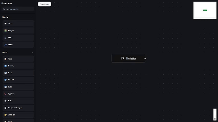

# 🧠 FlowBuilder Base

Este é um projeto **modelo de FlowBuilder** para ser usado como base em qualquer novo projeto que utilize lógica visual de fluxos (tipo Typebot, Landbot, etc).

## 📸 Demonstração
<br>
<p align="center">
  
</p>
<br>
> Exemplo acima mostra o sistema de nós conectados com lógica de edge personalizada e botão de exclusão.

---

## 📦 Tecnologias

- ⚛️ **React** com Vite
- 🧩 **React Flow (@xyflow/react)**
- 🎨 **Chakra UI**
- 🧠 Lógica customizada de edge com `showDelete`
- 💾 Persistência local de fluxos
- 📐 Suporte a grupos, conexões inteligentes, movimentação fluida

---

## 🚀 Como usar

```bash
git clone https://github.com/seu-usuario/flowbuilder-base.git
cd flowbuilder-base
npm install
npm run dev
